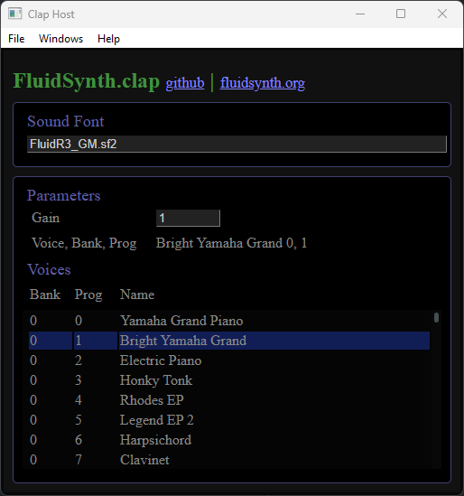

# FluidSynth.clap plugin 

- [intro](#intro)
- [install with fluidsynth](#install-with-fluidsynth)
- [presets, soundfonts](#presets-soundfonts)
- [state save/restore](#state-saverestore)
- [parameters](#parameters)
- [release history](#release-history)
- [known issues](#known-issues)
  - [Using with clap-host example host:](#using-with-clap-host-example-host)
  - [Windows](#windows)
- [see also](#see-also)
- [devinstall](#devinstall)
  - [win32](#win32)
  - [linux](#linux)
  - [macos](#macos)
- [implementation notes](#implementation-notes)
  - [todo](#todo)
- [buyer beware](#buyer-beware)
- [license](#license)

## intro

<center></center>

`FluidSynth.clap` is a simple, open source bridge to 
the [fluidsynth soundfont synthesizer](https://fluidsynth.org) in the 
form of a [CLAP plugin](https://github.com/free-audio/clap).


## install with fluidsynth

In our github releases you can find a .zip or .dmg file that 
includes both the fluidsynth.clap plugin _and_ the fluidsynth runtime 
components.  Download, then unpack the file into one of these standard 
CLAP plugin locations.  

| platform | type   | typical path                       |
| :------- | :----- | :--------------------------------- |
| Windows  | system | c:/Program Files/Common Files/CLAP |
| Windows  | user   | $LOCALAPPDATA/Programs/CLAP  |
| MacOS    | system | /Library/Audio/Plug-Ins/CLAP       |
| MacOS    | user   | $HOME/Library/Audio/Plug-Ins/CLAP  |
| Linux    | system | /usr/lib/clap                      |
| Linux    | user   | $HOME/.clap                        |

If you already have a fluidsynth installation or wish to build your own 
plugin see [below](#devinstall).

## presets, soundfonts

To make any sound using fluidsynth you must load a soundfont file. 
A default soundfont may not be available on your system but soundfont 
files can easily be found on the internet. The go-to starter soundfont 
is `FluidR3_GM.sf2`. `fluidsynth.clap` looks for a default soundfont 
according to these platform-specific conventions:

| platform | type   | location                                               |
| :------- | :----- | :----------------------------------------------------- |
| Windows  | system | C:/Program Files/Common Files/Sounds/Banks/default.sf2 |
| Windows  | user   | $LOCALAPPDATA/Sounds/Banks/default.sf2                 |
| MacOS    | system | /Library/Audio/Sounds/Banks/default.sf2                |
| MacOS    | user   | $HOME/Library/Audio/Sounds/Banks/default.sf2           |
| Linux    | system | /usr/share/sounds/sf2/default.sf2                      |
| Linux    | custom | /usr/local/share/sounds/sf2/default.sf2                |
| Linux    | user   | $HOME/Documents/sounds/sf2/default.sf2                |

To override these defaults, we employ CLAP's _preset extension_ to allow you 
to request an alternate soundfont file.  In other words, `.sf2` files *are* 
the preset files compatible with this plugin.  To load a soundfont you should 
be able to request a preset load via your favorite CLAP host application.

Here are a few sources for free soundfonts:

* [FluidR3_GM](https://keymusician01.s3.amazonaws.com/FluidR3_GM.zip)
* [Fatboy](https://fatboy.site/)
* [MuseScore links](https://musescore.org/en/handbook/soundfonts-and-sfz-files#list)
* [FlameStudios guitar soundfonts](http://www.hedsound.com/2019/07/flamestudios-guitar-soundfonts-in-sf2.html)

## state save/restore

We support the `clap.state` extension but since the state includes
the filepath to the active soundfont, state files may not be
perfectly portable.

## parameters

In typical usage, `fluidsynth` exposes a large collection of "canned" instrument
sounds that are selected by the instrument index. Thus, very little user-interface
is required. Just select instrument/bank indices in your sound font. Most CLAP
hosts offer a stripped-down parameter editing interface which may suffice to
select different gain and program settings.

The [General Midi standard](https://cannerycoders.com/docs/fiddle/reference/midiGM1.html)
defines a standard mapping between an index and an instrument. Soundfonts
with `GM` in their name purport to follow this convention.

Here are the exposed/supported fluidsynth parameters and their ids.

| id range | description                             | value range | default |
| :------- | :-------------------------------------- | :---------- | :------ |
| 0        | gain                                    | 0-10        | 0.2     |
| 1        | reverb                                  | 0,1         | 1       |
| 2        | roomsize                                | 0-1.2       | 0.2     |
| 3        | damping                                 | 0-1         | 0.0     |
| 4        | width                                   | 0-100       | .5      |
| 5        | reverblevel                             | 0-1         | 0.9     |
| 6        | chorus                                  | 0,1         | 1       |
| 7        | chorusNR                                | 0-99        | 3       |
| 8        | choruslevel                             | 0-10        | 2       |
| 9        | chorusspeed                             | 0-1         | .3      |
| 10       | chorusdepth                             | 0-256       | 8       |
| 11       | chorusmod                               | 0,1         | 1       |
| 32-47    | program associated with midi chans 0-15 | 0-127       | 0       |
| 48-63    | bank associated with midi chans 0-15    | 0-127       | 0       |

More details on these settings can be found [in the fluidsynth docs](https://www.fluidsynth.org/api/settings_synth.html).

## release history

* 0.1.0 - windows only (crashed clap-host)
* 0.2.0 - three platforms (crashed clap-host)
* 0.2.1 - fixed crashing issues with clap-host (7/8/2023)

## known issues

### Using with clap-host example host:

* clap-host doesn't deliver/implement all the MIDI events esp: 
    * program change
    * pitch-wheel
    * doesn't handle transitive dlls on windows

### Windows

* our plugin needs external dlls to access fluidsynth functions.
  Some CLAP hosts handle this, others don't. Developers of Clap Hosts
  should consider adding a call to `SetDllDirectory(..dir that contains dlls...)`.
  Otherwise you might experiment with including this dir in your PATH or
  even launching the host from within the FluidSynth.clap directory.

## see also

[soundfont wikipedia](https://en.wikipedia.org/wiki/SoundFont) |
[CLAP plugins](https://github.com/free-audio/clap) |
[fluidsynth](https://fluidsynth.org) |
[juicysfplugin (VST, VST3, Au)](https://github.com/Birch-san/juicysfplugin)

## devinstall

This plugin has dependencies on the `dlls` that implement fluidsynth, 
obtaining them depends upon the platform (OS plus architecture).
Our intention is to make the entire collection of .clap and .dll/.so files
available via our releases tags. This means that in order to use this
plugin you need only download the latest .zip file and decompress it
into a standard CLAP location (system or user).

Depending on your CLAP host and platform security settings, you may still need
to add the location of `FluidSynth.clap` to `PATH`, and/or `LD_LIBRARY_PATH`.

If you wish to build or download fluidsynth yourself, please proceed to
the platform-specific instructions that follow.

### win32

Windows users can download a pre-compiled collection of fluidsynth
runtime components [here](https://github.com/FluidSynth/fluidsynth/releases).
The .zip file is organized in linux fashion with `bin`, `lib` and `include`
directories.  In order for FluidSynth.clap to find the .dll files you may
need to add the install location to your PATH.

Another approach is to install vcpkg and then build fluidsynth yourself.

```sh
git clone https://github/microsoft/vcpkg (etc)
vcpkg install fluidsynth`
```

### linux 
Linux users have the easiest job because fluidsynth is widely available as 
a linux package.  For example on debian: 

```sh
sudo apt-get install fluidsynth fluid-soundfont-gm
```

And to obtain the compile/API support:

```sh
sudo apt-get install libfluidsynth-dev
```

That said, we employ fluidsynth API version 2.3.X.  If your linux
distro is conservative, it's possible you won't be able to compile
without upgrading your libfluidsynth package(s).

### macos

MacOS users either obtain the fluidsynth runtime with this fluidsynth plugin 
distribution (statically linked) or build/install them following the 
developer procedure below.  If you take the second road, the result may
only run on your own development machine due to MacOS security and
external DLL dependencies.

This requires that you install [homebrew](https://brew.sh).

```sh
brew install fluidsynth
```

## implementation notes

FluidsynthPlugin derives from clap/helpers/plugin.hh which
provides methods/routes for common extensions. Since we 
provide a single plugin, factory functions are implemented 
in `dllMain.cpp`. This is where the primary dll entrypoint,
`clap_plugin_entry` is found.

We currently rely on a home-grown build system, [jsmk](https://github.com/dbadb/jsmk),
to compile and link our plugin code. This includes per-platform 
logic for locating the required fluidsynth libraries.  Since there are
so few files in our implementation it should be straightforward to build 
using your favorite build system.

### todo

* implement an appropriately simple GUI.

* implement more CCs following the pattern implemented in
  [juicysfplugin](https://github.com/Birch-san/juicysfplugin).

* Most fluidsynth effects parameter changes are thread-safe but may cause
glitches when performed during audio processing.  Value changes
could (should?) trigger a reactivate request.


## buyer beware

We offer no warranties, guarantees or commitments. Watch out for sharp
edges, this is not a toy, though it may appear so.

## license

Sourcecode provided herein is subject to the MIT license.  

Binaries provided via releases may include components with different licenses.

Fluidsynth is GPL2, license found [here](https://github.com/FluidSynth/fluidsynth/blob/master/LICENSE).
Fluidsynth relies on other components subject to their own licenses.

The Clap plugin API is MIT licensed, licenses found
[here](https://github.com/free-audio/clap/blob/main/LICENSE)
and [here](https://github.com/free-audio/clap-helpers/blob/main/LICENSE).
